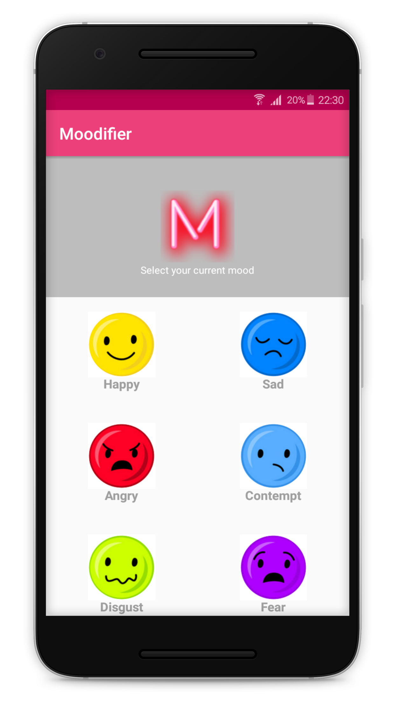
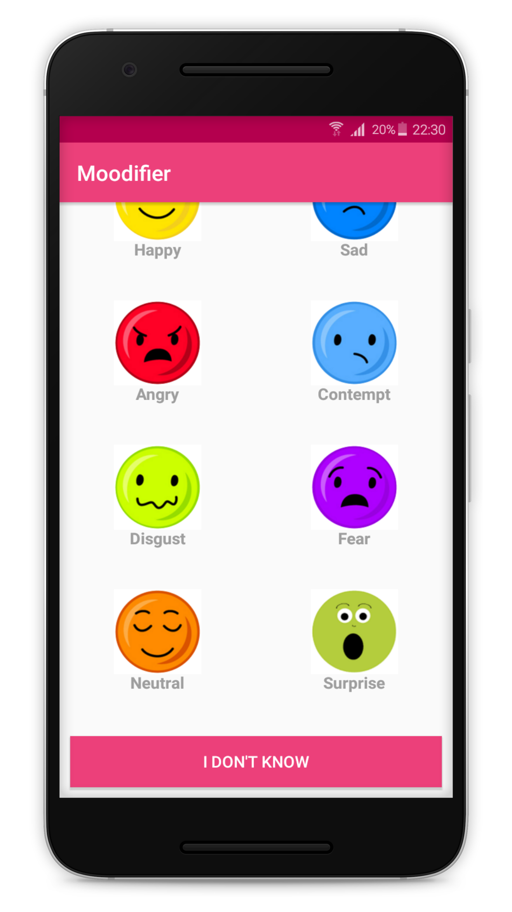
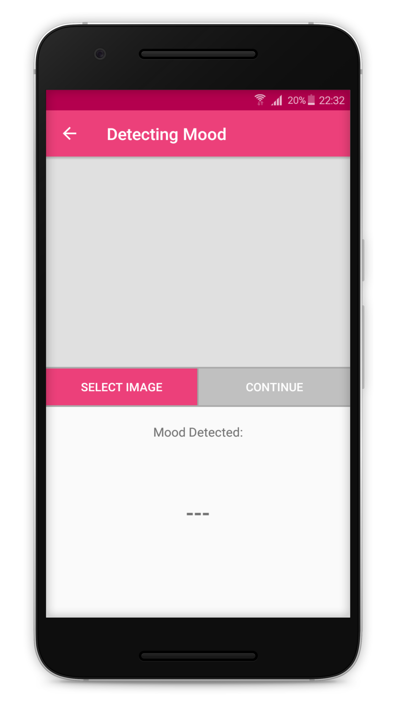
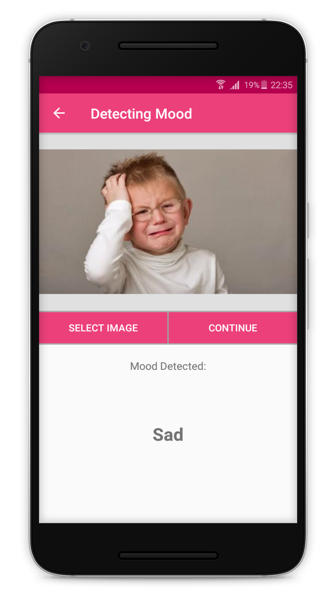
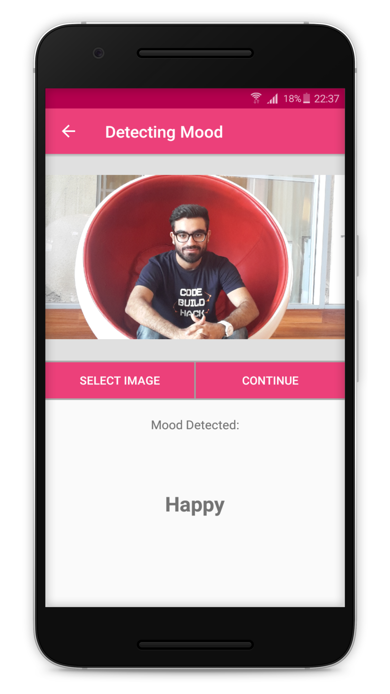
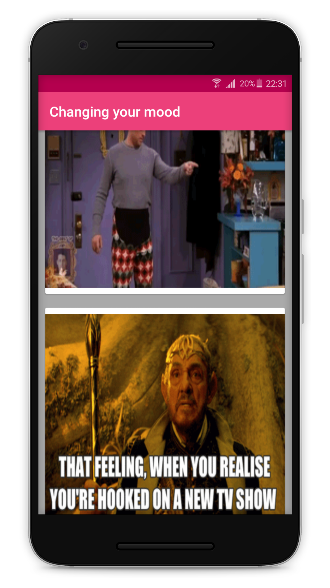
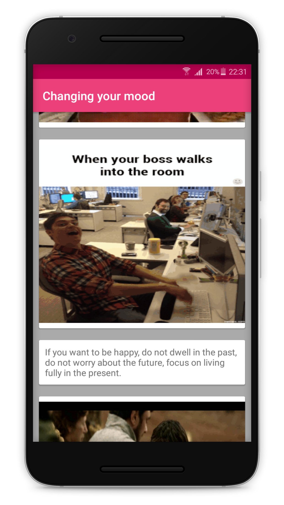

  
# Moodifier  
  
#### __*Android Application which will intensify your current mood.*__ 
  
  
  
  
## Abstract
  
Moodifier will boost your current mood. Whether you are happy, sad, angry, surprised, it will certainly try to boost your mood to a 
great extent. This application will involve Face recognition, Detect Emotion and accordingly will try to make him/her happy.
  
  
  
  
## How will Emotion recognised?
    
Emotive analytics is an interesting blend of psychology and technology . Though arguably reductive, many facial expression detection 
tools lump human emotion into 7 main categories: Joy, Sadness, Anger, Fear, Surprise, Contempt, and Disgust. With facial emotion 
detection , algorithms detect faces within a photo or video, and sense micro expressions by analyzing the relationship between points 
on the face, based on curated databases compiled in academic environments.
  
  
  
  
## How it works :question:  
  
__Step 1__: You can either Select your mood (OFFLINE FEATURE) OR Scan your current mood (REQUIRES INTERNET CONNECTION).  
__Step 2__: Texts, Jokes, Quotes, Images, Memes, Videos, Gifs will be displayed on your newsfeed in order to intensify your detected/selected 
mood.  
  
  
  
  
## Technology Stack  
  
❏ Android Studio  
❏ Java Programming  
❏ XML for Layouts  
❏ Google Face Detection API  
❏ Microsoft Cognitive API  
❏ Image Processing  
❏ Smart Animation Library  
❏ Android SDKs   
  
  
  
  
## How to Build?
  
* launch Android Studio
* select **Open an existing Android Studio project**
* select the project folder
* select menu **Run** -> **Run 'app'**  
  
  
  
    
## Screenshots  
   
    
   
    
   
    
   
    
   
    
    
    
## Want to contribute?  
  


If you don't have git on your machine, [ install it ]( https://help.github.com/articles/set-up-git/ ).

### Fork this repository

Fork this repo by clicking on the fork button on the top of this page.
This will create a copy of this repository in your account.

### Clone the repository


Now clone this repo to your machine. Click on the clone button and then click the *copy to clipboard* icon.

Open a terminal and run the following git command:

```
git clone "url you just copied"
```
where "url you just copied" (without the quote marks) is the url to this repository. See the previous steps to obtain the url.


For example:
```
git clone https://github.com/this-is-you/Moodifier.git
```
where `this-is-you` is your GitHub username. Here you're copying the contents of the first-contributions repository in GitHub to your computer.

### Create a branch

Change to the repository directory on your computer (if you are not already there):

```
cd Moodifier
```
Now create a branch using the `git checkout` command:
```
git checkout -b <add-your-name>
```

For example:
```
git checkout -b add-alonzo-church
```
(The name of the branch does not need to have the word *add* in it, but it's a reasonable thing to include because the purpose of this branch is to add your name to a list.)


### Push changes to GitHub

Push your changes using the command `git push`:
```
git push origin <add-your-name>
```
replacing `<add-your-name>` with the name of the branch you created earlier.

### Submit your changes for review

If you go to your repository on GitHub, you'll see a  `Compare & pull request` button.  Click on that button.


Now submit the pull request.


Soon I'll be merging all your changes into the master branch of this project. You will get a notification email once the changes have been merged.  
  

